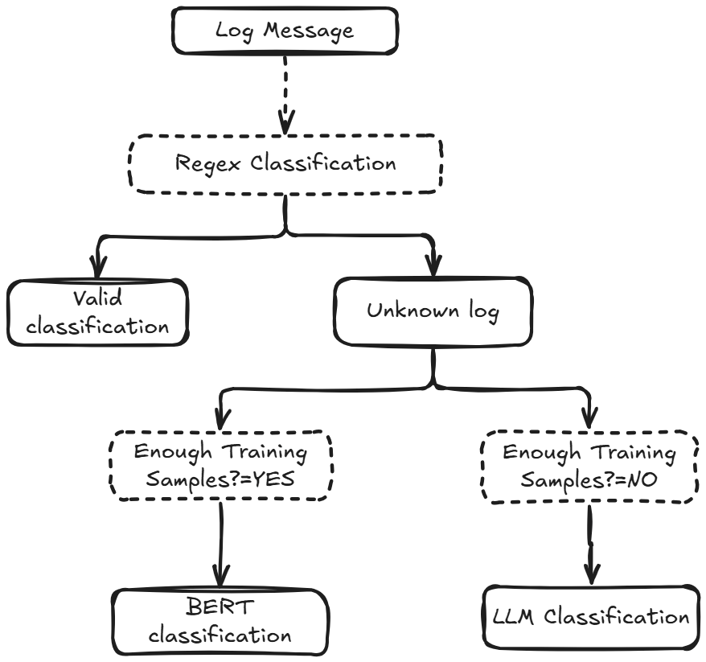

# Log Files Classifiyer System

This project implements a hybrid log classification system, combining three complementary approaches to handle varying levels of complexity in log patterns. The classification methods ensure flexibility and effectiveness in processing predictable, complex, and poorly-labeled data patterns. This system can be very effective in monitoring the logs.

---

## Classification Approaches

1. **Regular Expression (Regex)**:
   - Handles the most simplified and predictable patterns.
   - Useful for patterns that are easily captured using predefined rules.

2. **Sentence Transformer + Logistic Regression**:
   - Manages complex patterns when there is sufficient training data.
   - Utilizes embeddings generated by Sentence Transformers and applies Logistic Regression as the classification layer.

3. **LLM (Large Language Models)**:
   - Used for handling complex patterns when sufficient labeled training data is not available.
   - Provides a fallback or complementary approach to the other methods.

Here is the architecture of this system:

<p align="center"></p>


---

## Folder Structure

1. **`Datasets/`**:
   - Contains the code for training models using Sentence Transformer and Logistic Regression.
   - Includes the code for regex-based classification.
   - Includes a dataset of synthetic logs.

2. **`models/`**:
   - Stores the saved models, including Sentence Transformer embeddings and the Logistic Regression model.

3. **`resources/`**:
   - This folder contains resource files such as test CSV files, output files, images, etc.

4. **Root Directory**:
   - Contains the FastAPI endpoint (`micro_service.py`).
   - Includes every processing approach from regex classification to LLM classification.

---

## Setup Instructions

1. **Install Dependencies**:
   Make sure you have Python installed on your system. Install the required Python libraries by running the following command:

   ```bash
   pip install -r requirements.txt
   ```

2. **Run the FastAPI Server**:
   To start the server, use the following command:

   ```bash
   uvicorn server:app --reload
   ```

   Once the server is running, you can access the API at:
   - `http://127.0.0.1:8000/` (Main endpoint)
   - `http://127.0.0.1:8000/docs` (Interactive Swagger documentation)
   - `http://127.0.0.1:8000/redoc` (Alternative API documentation)

---

## Usage

Upload a CSV file containing logs to the FastAPI endpoint for classification. Ensure the file has the following columns:
- `source`
- `log_message`

The output will be a CSV file with an additional column `target_label`, which represents the classified label for each log entry.

